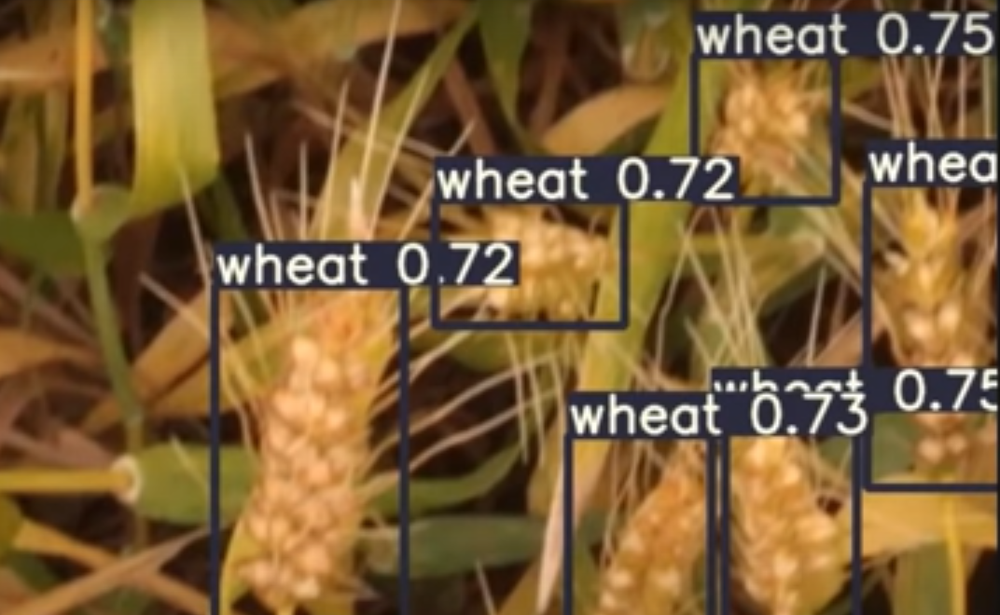

# Custom WheatHead Detection using the YOLOv5 model

The wheathead detection is a popular challenge on Kaggle where you have to
detect the wheatheads and draw bounding boxes around them. In this competition , we have 3422 images for training
and about 10 fo test. It also contains a csv which serves as a metadata for the image id, image dimensions and the
bounding box co-ordinates.

* First clone the official repository from here 
  
  https://github.com/ultralytics/yolov5

* According to the official [Train Custom Data]guide, YOLOv5 requires a certain directory structure. 

```
/parent_folder
    /dataset
         /images
         /labels
    /yolov5
```

This is very important to keep in mind. I couldnot upload the whole image dataset and the directory but follow this format to align your directory. Make sure to
put this directory inside the cloned yolov5 repository.

## How to run the code

1. Go to the folder where munge.py file is present
2. Type cmd in the file path 
3. Run the code with command `python train.py --image_dimension --batch_size  --no_of_epochs --yaml file --configuration --model name`
 In my case , I used 'python train.py --img 1024 --batch 8 --epochs 100 --data wheat.yaml --cfg models/yolov5s.yaml --name wm'

## Example Output



